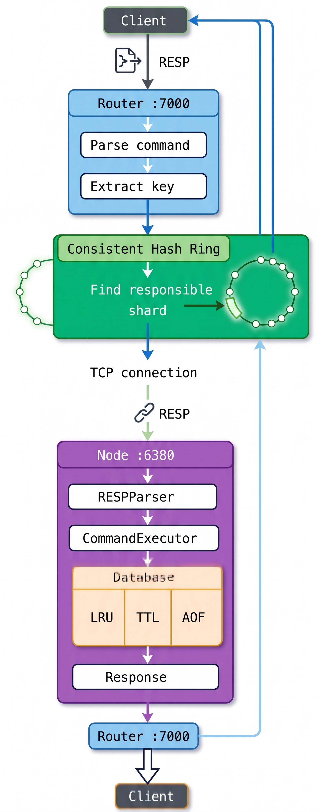
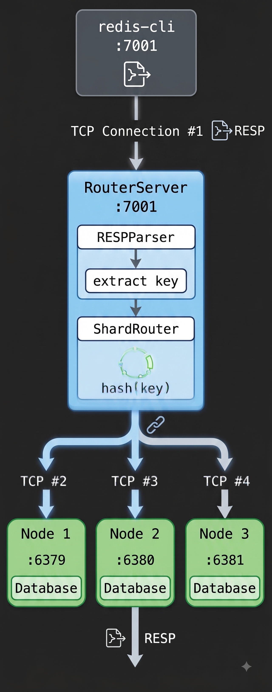

# MiniRedis

A simplified Redis-like in-memory key-value store written in C++.

The project started as a single Redis-like server and was extended with:

- **RESP protocol** parsing and encoding
- **TCP client-server** communication
- **In-memory key-value storage**
- **TTL / key expiration**
- **LRU eviction**
- **AOF persistence**
- **Automatic snapshots**
- **Consistent-hash based sharding**
- **RouterServer** that forwards commands to the correct shard
- **Automatic startup** of multiple shard processes
- **`.env` based configuration**
- **Maximum key limit** per shard

The main goal of this project is to understand how a Redis-like system works internally, especially networking, persistence, sharding, and request routing.

---

## Architecture Overview

The system consists of one **RouterServer** and multiple **MiniRedis Shard Nodes**.

<p align="center">
  
  <br>
  <em>Figure 1: High-level request execution flow through Router and Shard</em>
</p>

```text
Client
  |
  | RESP over TCP
  v
RouterServer :7000
  |
  |-- Parse command
  |-- Extract key
  |-- Hash key
  |-- Find responsible shard
  |
  v
Shard
  |
  |-- RESPParser
  |-- CommandExecutor
  |-- Database
  |     |-- Key-Value storage
  |     |-- TTL
  |     |-- LRU
  |
  |-- AOF / Snapshot
```

### Default Ports

| Component | Port | Description |
| :--- | :--- | :--- |
| **Router** | `7000` | Accepts all client traffic and routes to target shards |
| **Shard 1** | `6379` | Independent Redis-like storage node |
| **Shard 2** | `6380` | Independent Redis-like storage node |
| **Shard 3** | `6381` | Independent Redis-like storage node |

> *Note: Ports and configurations can be customized via `.env` file.*

---

## Overall Request Flow

Suppose the client sends:

```sql
SET user123 Anshul
```

The actual communication uses **RESP**. The request flow operates as follows:

<p align="center">
  
  <br>
  <em>Figure 2: TCP connection layout between Client, Router, and Shard Nodes</em>
</p>

```text
Client
   |
   | TCP connection
   v
RouterServer
   |
   | RESPParser
   |
   | Extract key = "user123"
   |
   | ShardRouter
   |
   | hash("user123")
   |
   | Find responsible shard
   |
   v
Shard (e.g., :6380)
   |
   | RESPParser
   |
   | CommandExecutor
   |
   | Database::set()
   |
   | AOF
   |
   v
Response
   |
   v
RouterServer
   |
   v
Client
```

> **Key takeaway:** The client does not need to know which shard holds the key. It communicates exclusively with the router.

---

## Deep-Dive into Components

### 1. TCP Server
Each MiniRedis shard is an independent TCP server (e.g., `:6379`, `:6380`, `:6381`).

Each server:
1. Creates a TCP socket.
2. Binds the socket to its port.
3. Calls `listen()`.
4. Waits for incoming connections using `accept()`.
5. Spawns a separate thread for each client.
6. Receives RESP commands, executes them, and sends the RESP response back.

**Implementation files:**
- `include/server/Server.h`
- `src/server/Server.cpp`

---

### 2. RESP Protocol
MiniRedis uses the Redis Serialization Protocol (RESP).

For example, `SET name Anshul` is encoded as:
```text
*3\r\n
$3\r\n
SET\r\n
$4\r\n
name\r\n
$6\r\n
Anshul\r\n
```

`RESPParser` converts the raw TCP data stream into tokens:
```cpp
["SET", "name", "Anshul"]
```

#### Handling TCP Framing
A single `recv()` call doesn't guarantee receiving exact command boundaries (commands can arrive partially or batched together). To solve this, `inputBuffer` is maintained across multiple `recv()` calls.

**Implementation files:**
- `include/protocol/RESPParser.h` / `src/protocol/RESPParser.cpp`
- `include/protocol/RESPEncoder.h` / `src/protocol/RESPEncoder.cpp`

---

### 3. Command Execution
After parsing, the command array is delivered to `CommandExecutor`, which dispatches operations (`SET`, `GET`, `DEL`, `TTL`, etc.) to the underlying database.

---

### 4. In-Memory Database
The core data structure inside `Database` relies on standard containers:

- **Key-Value Store:** `std::unordered_map<std::string, std::string> data;`
- **TTL Expiry Map:** `std::unordered_map<std::string, long long> expiry;`

**Implementation files:**
- `include/storage/Database.h`
- `src/storage/Database.cpp`

---

### 5. TTL (Time to Live)
Keys can be stored with expiration intervals:

```sql
SET tempkey TempValue EX 1000
```

When `GET` or `TTL` is invoked, the database checks whether the current timestamp exceeds the stored expiration timestamp. If expired, the key is lazily deleted and returns `(nil)`.

---

### 6. LRU Eviction
To keep memory usage within boundaries, each shard enforces a max key threshold defined by `MAX_KEYS`.

The database tracks access sequence using an LRU structure:
```cpp
std::list<std::string> lruList;
std::unordered_map<std::string, std::list<std::string>::iterator> lruMap;
```

#### Eviction Flow
```text
SET / GET  -->  touchKey()  -->  Move key to back of lruList
```
If `data.size() > maxKeys`, the least recently used key (at the front of `lruList`) is automatically evicted.

---

### 7. AOF Persistence
MiniRedis provides durability via an **Append-Only File (AOF)** mechanism managed by `AOFManager`. All write operations are logged to disk and replayed during server startup to reconstruct the database state.

**Implementation files:**
- `include/persistence/AOFManager.h`
- `src/persistence/AOFManager.cpp`

---

### 8. Snapshots
In addition to AOF, background snapshots run via `snapshotLoop()`. Periodically (e.g., `SNAPSHOT_INTERVAL=300`), a background thread dumps the entire state to disk.

---

### 9. Sharding & Consistent Hashing

Sharding distributes key-value pairs across separate server processes using consistent hashing provided by `ShardRouter`.

```text
             6379
              *
          *       *
       *             *
     *                 *
    *       HASH        *
     *      KEY        *
       *             *
          *       *
             *
            6380
              *
             6381
```

The router maintains a ring using `std::map<size_t, int>` where `hash_position -> shard_port`:
1. Node hashes are added to the ring: `hash("node:" + port)`.
2. When evaluating a key, `hash(key)` is calculated.
3. `hashRing.lower_bound(hashValue)` finds the first node moving clockwise.
4. If it exceeds the last hash position, it wraps around to `hashRing.begin()`.

**Implementation files:**
- `include/sharding/ShardRouter.h`
- `src/sharding/ShardRouter.cpp`

---

### 10. RouterServer & Networking
`RouterServer` is the entry point for clients.

**Responsibilities:**
- Accepts client TCP connections.
- Parses incoming RESP payloads.
- Extracts keys and queries `ShardRouter`.
- Opens a TCP connection to the responsible shard node.
- Forwards the request and relays the response back to the client.

#### Dual-Connection Architecture
1. **Client $\rightarrow$ Router:** Single persistent connection held by the client.
2. **Router $\rightarrow$ Shard:** Router dynamically proxies requests to destination shards via port mapping (`127.0.0.1:<shard_port>`).

**Implementation files:**
- `include/router/RouterServer.h`
- `src/router/RouterServer.cpp`

---

### 11. Automatic Shard Process Management
Rather than manually launching each shard binary, `RouterServer` manages process creation during startup using `fork()` and `execl()`.

Executing:
```bash
./build/MiniRedisRouter
```

Automatically spawns child processes for port `6379`, `6380`, and `6381`, each running isolated with its own thread pool, database, AOF file, and LRU cache.

---

## Configuration (`.env`)

Configuration options are managed globally through `Config` (`include/config/Config.h`, `src/config/Config.cpp`).

```env
ROUTER_PORT=7000
SHARD_PORTS=6379,6380,6381
SNAPSHOT_INTERVAL=300
MAX_KEYS=1000
```

| Parameter | Description |
| :--- | :--- |
| `ROUTER_PORT` | Port for client connections |
| `SHARD_PORTS` | Comma-separated list of active shard ports |
| `SNAPSHOT_INTERVAL` | Time interval in seconds between snapshots |
| `MAX_KEYS` | Maximum allowed key capacity per individual shard |

---

## Project Structure

```text
MiniRedis/
│
├── .env
├── CMakeLists.txt
├── README.md
│
├── images/
│   ├── img1.png
│   └── img2.png
│
├── include/
│   ├── config/
│   │   └── Config.h
│   ├── executor/
│   │   └── CommandExecutor.h
│   ├── persistence/
│   │   └── AOFManager.h
│   ├── protocol/
│   │   ├── RESPParser.h
│   │   └── RESPEncoder.h
│   ├── router/
│   │   └── RouterServer.h
│   ├── server/
│   │   └── Server.h
│   ├── sharding/
│   │   └── ShardRouter.h
│   └── storage/
│       └── Database.h
│
└── src/
    ├── config/
    │   └── Config.cpp
    ├── executor/
    │   └── CommandExecutor.cpp
    ├── persistence/
    │   └── AOFManager.cpp
    ├── protocol/
    │   ├── RESPParser.cpp
    │   └── RESPEncoder.cpp
    ├── router/
    │   └── RouterServer.cpp
    ├── server/
    │   └── Server.cpp
    ├── sharding/
    │   └── ShardRouter.cpp
    ├── storage/
    │   └── Database.cpp
    ├── main.cpp
    └── main_router.cpp
```

---

## Quick Reference Table

| Component | Role / Purpose |
| :--- | :--- |
| `Server` | Executes single MiniRedis shard instances |
| `RouterServer` | Accepts client requests and routes payloads |
| `ShardRouter` | Implements consistent hashing to select shards |
| `RESPParser` | Decodes raw TCP bytes into command tokens |
| `RESPEncoder` | Encodes responses into valid RESP wire format |
| `CommandExecutor` | Maps commands to database operations |
| `Database` | Main in-memory store (Data, TTL, LRU) |
| `AOFManager` | Manages append-only write logs |
| `Config` | Parses `.env` settings |

---

## How to Build & Run

### 1. Build the Project
From the project root:

```bash
cmake -S . -B build
make -C build
```

This generates two executables:
- `build/MiniRedis` (Individual Shard Server)
- `build/MiniRedisRouter` (Router + Process Manager)

---

### 2. Launch Router + All Shards (Recommended)

```bash
./build/MiniRedisRouter
```

**Output:**
```text
Starting shard nodes...
Started shard on port 6379
Started shard on port 6380
Started shard on port 6381

Router listening on port 7000
```

---

### 3. Launch an Individual Shard Manually
Useful for testing single nodes in isolation:

```bash
./build/MiniRedis 6379
```

---

### 4. Connect Using `redis-cli`

```bash
redis-cli -p 7000
```

Execute standard commands:
```sql
127.0.0.1:7000> SET name Anshul
OK
127.0.0.1:7000> GET name
"Anshul"
127.0.0.1:7000> DEL name
(integer) 1
```

---

### 5. Connect via Raw TCP (`netcat`)

```bash
nc 127.0.0.1 7000
```

Send raw RESP formatted bytes:
```text
*2\r\n$3\r\nGET\r\n$4\r\nname\r\n
```

---

## Verification & Testing Examples

### Sharding Test

1. Start router: `./build/MiniRedisRouter`
2. Connect: `redis-cli -p 7000`
3. Execute:
   ```sql
   SET user1 Anshul
   SET user2 Kumar
   SET user3 NSUT
   ```

**Router Terminal Log Output:**
```text
Key 'user1' routed to port 6380
Key 'user2' routed to port 6379
Key 'user3' routed to port 6381
```

---

### TTL Expiration Test

```sql
SET tempkey TempValue EX 10
GET tempkey   # Returns "TempValue"
TTL tempkey   # Returns remaining seconds (~10)
```
*Wait 10 seconds...*
```sql
GET tempkey   # Returns (nil)
```

---

### LRU Eviction Test (with `MAX_KEYS=3`)

```sql
SET key1 value1
SET key2 value2
SET key3 value3
GET key1        # Touches key1, moving it to MRU position
SET key4 value4  # Max capacity exceeded! Triggers eviction of LRU key (key2)
```

---

## Important Architectural Notes

1. **Sharding $\neq$ Replication**
   - Keys are distributed across nodes (`Key A -> Shard 1`, `Key B -> Shard 2`).
   - Keys are **not replicated**. If a shard node drops, keys mapped to it become unavailable.
2. **Router is Stateless regarding Data**
   - The Router only parses and routes keys; it does **not** keep key-value data in memory.
3. **Shards operate in Isolation**
   - Shards do not share memory; all communication occurs over standard TCP sockets.

---

## Core Execution mental model

```text
CLIENT
  ↓
TCP Connection
  ↓
RouterServer
  ↓
RESPParser
  ↓
Extract key
  ↓
ShardRouter
  ↓
Consistent Hashing
  ↓
Target MiniRedis Shard
  ↓
RESPParser
  ↓
CommandExecutor
  ↓
Database (Hash Map / TTL / LRU)
  ↓
AOF / Snapshot
  ↓
RESP Response
  ↓
RouterServer
  ↓
CLIENT
```

> **Summary:** *The router decides **WHERE** the command goes; the shard decides **WHAT** to do with the command.*